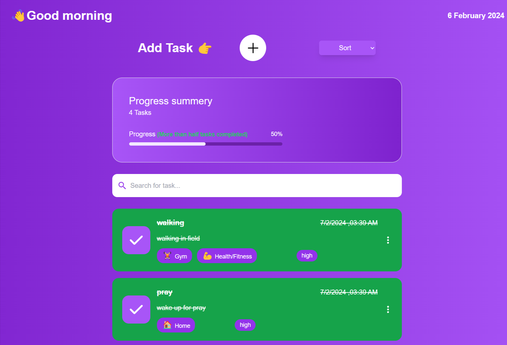

# React Todo List

The "React Todo List with Local Storage" project is a web-based task management application developed using React, designed to empower users to organize their tasks effectively while utilizing local storage for data persistence. This open-source project is hosted on GitHub, making it accessible to developers and contributors who want to use, enhance, or collaborate on the project.

# Tech Stack💻:

- React js
- Tailwind CSS

# Features🗒:

**Local Storage Integration🔧:**

- Task data is stored in the browser's local storage, ensuring that tasks persist even after the browser is closed or refreshed.

**Responsive Design📤:**

- The application is designed to be responsive, delivering a seamless experience across various devices, including mobile phones and tablets.

**User-Friendly Interface📈:**

- The React Todo List offers a clean and intuitive user interface, ensuring that users can efficiently manage their tasks.

**Task Creation⚡:**

- Users can easily create new tasks, providing a title and optional details for each task.

**Task Creation based on priority⚡:**

- Users can set priority for their tasks. Each priority have their own status color.

**Task Status✉️:**

- Tasks can be marked as either complete or incomplete, allowing users to monitor their progress.

**Task Deletion➿:**

- Unwanted tasks can be swiftly deleted, maintaining an organized task list.

**Task Edit ✏️:**

- Seamlessly update task details to keep your information accurate and up-to-date.

**Task Copy 📋:**

- Duplicate tasks to save time on creating similar entries.

**Search Tasks 🔍:**

- Search functionality allows you to filter tasks by name or description, making it easy to find what you need.

**Task Progress: 🔄:**

- Monitor your overall task progress, providing a visual representation of your accomplishments.

The "React Todo App with Local Storage" project offers a valuable task management solution by combining usability with data resilience. It utilizes local storage for data persistence, making it an ideal choice for developers seeking a reliable and customizable task management application that can be deployed locally and maintain task data across sessions. The open-source approach encourages collaboration and continuous improvement.
The provided search results offer insights into building a React Todo App with local storage, including code examples, GitHub repositories, and a tutorial. These resources can be helpful for developers looking to implement local storage in their React-based task management applications.

# Screenshots:

**Home Page:**

**Add new todo:**

**Edit todo:**

**Todo deletion:**

**Complete status for todo:**

**Search functionality:**

**User option:**

**Todo details page:**

**No task found:**

